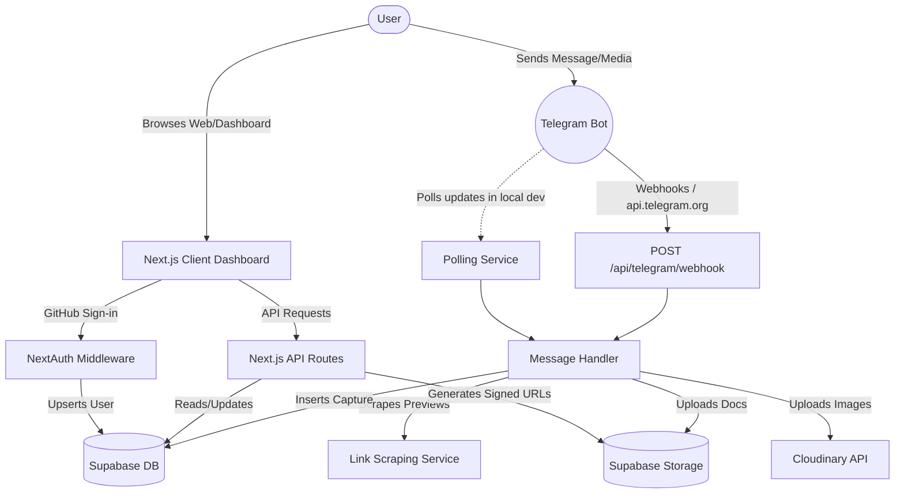

# Project Overview: drop_it

`drop_it` is a productivity tool and personal digital inbox designed to capture, organize, and catalog links, plain text notes, images, and documents directly from Telegram into a clean, searchable web dashboard. It bridges the gap between quick-capture workflows (e.g., messaging a bot on-the-go) and organized content curation.

---

## 1. Core Purpose & Why it Exists
When users browse content on mobile devices or during messaging workflows, they frequently lack a friction-free way to save items for future reference. Desktop bookmarking is inaccessible, and traditional "read-later" services require downloading heavy apps or navigating slow sharing interfaces.

`drop_it` addresses this by leveraging **Telegram** as the primary input mechanism. Sending a message, forwarding a link, uploading an image, or sending a PDF to a Telegram bot registers it instantly in the user's dashboard. The web interface acts as a personal knowledge base where saved items can be categorized into folders, bookmarked, searched, or processed.

---

## 2. Key Features
*   **Zero-Friction Capture**: Send text notes, web links, images, or documents to a dedicated Telegram bot.
*   **Account Linking (Auto & Manual)**: Fully automated OAuth-based GitHub sign-in, with two ways to link Telegram accounts:
    *   *Auto-linking (Token Flow)*: A temporary 24-hour token URL generated on the dashboard is redeemed by inputting the user's Telegram ID.
    *   *Manual linking*: Direct insertion of a Telegram ID in account settings.
*   **Intelligent Link Previews**: Scrapes web links on-the-fly using a fallback chain (Microlink API $\rightarrow$ Open Graph tags $\rightarrow$ HTML title tag $\rightarrow$ hostname domain).
*   **Media Routing**: Saves files using a multi-provider strategy governed by environment variables:
    *   Images can be routed to **Cloudinary** for fast CDN image delivery and dashboard previews.
    *   Documents (e.g., PDFs) can be stored in **Supabase Storage** under private, secure buckets and served via short-lived signed URLs.
*   **Dashboard Curation**: Group captured items into folders, filter by status (`read` / `unread`), filter by time range, search text using SQL `ilike` operations, and toggle between grid or list views.
*   **Soft Delete Lifecycle**: Trashed items are soft-deleted and automatically purged by database-level logic after 7 days.

---

## 3. Tech Stack
*   **Framework**: Next.js 16.2.4 (App Router)
*   **Library**: React 19.2.4
*   **Database & Storage**: Supabase (PostgreSQL with RLS, Supabase Storage for documents)
*   **Asset CDN**: Cloudinary (for image hosting and optimization)
*   **Authentication**: NextAuth.js (v4, GitHub OAuth Provider)
*   **Animations**: Framer Motion
*   **Styling**: TailwindCSS (v4) with custom shadcn/ui components (Radix primitives)
*   **External APIs**: Telegram Bot API, Microlink API

---

## 4. High-Level System Architecture
The application runs as a hybrid server-client system:



---

## 5. Repository Structure

```
drop_it/
├── app/                        # Next.js App Router (pages and API endpoints)
│   ├── api/                    # API backend routes
│   │   ├── auth/               # NextAuth routing (...nextauth)
│   │   ├── dev/                # Development helper endpoints (local test linking)
│   │   ├── folders/            # Folder management routes (create, list, update, delete)
│   │   ├── items/              # Item retrieval, actions, updates, and URL resolution
│   │   ├── linking/            # Auto-linking token generation and redemption
│   │   ├── search/             # Legacy query fallback route
│   │   ├── telegram/           # Webhook entry point for Telegram Bot API
│   │   └── user/               # Settings, linking, and user profile management
│   ├── auth/                   # Public auth views (signin)
│   ├── components/             # Application layout components (Navbar, ItemCard, ItemGrid)
│   ├── dashboard/              # Protected dashboard user interface
│   ├── link/                   # Entry point for the Telegram ID token verification page
│   ├── globals.css             # Main stylesheet (Tailwind directives)
│   ├── layout.tsx              # Root HTML wrapper and font loaders
│   ├── page.tsx                # Session-based landing redirector
│   └── providers.tsx           # Context wrappers (SessionProvider, ThemeProvider)
├── components/                 # Root component registry
│   └── ui/                     # Shared UI library (Radix wrapper components)
├── lib/                        # Shared libraries and server-side utilities
│   ├── auth/                   # NextAuth and DB session user resolvers
│   ├── handlers/               # Link parsing and preview scraping fallback engines
│   ├── storage/                # Media storage handlers (Cloudinary, Supabase, validations)
│   ├── telegram/               # Telegram message parser, API wrapper, and polling service
│   ├── supabase.ts             # Supabase Client and Admin credentials
│   ├── types.ts                # Application typescript interface declarations
│   └── utils.ts                # Tailwind class mergers
├── public/                     # Static client-side assets (favicon)
├── supabase/                   # Supabase environment setups
│   └── migrations/             # Sequential SQL migration files
├── next.config.ts              # Next.js configuration settings
├── tsconfig.json               # TypeScript compiler rules
└── package.json                # Project script registry and node dependencies
```

---

## 6. How Everything Connects
1.  **Ingestion Phase**: A message is received from Telegram. The bot server notifies the app via webhook (production) or polling (development).
2.  **Verification & Processing**: `messageHandler.ts` checks if the Telegram sender's ID matches a record in `public.users`. If not, it returns linking instructions. If matched, it identifies the message content type.
3.  **Media Upload & Preview Scraping**:
    *   If it is a link, it is scraped by `linkHandler.ts` for metadata.
    *   If it is a file, the handler downloads it from Telegram servers, validates it via `fileValidation.ts`, and uploads it to either Cloudinary or Supabase Storage depending on the `FILE_STORAGE_STRATEGY` env setting.
4.  **Database Recording**: A new item is inserted into the `items` table in Supabase. A success status is returned to the user on Telegram.
5.  **Dashboard Display**: The user opens the dashboard, logs in via GitHub, and the client fetches items via `/api/items`. The UI displays link cards with rich previews, notes, or media. Trashed files undergo a database-level soft delete, and the client prompts a daily DB-level RPC cleanup to wipe items older than 7 days.
