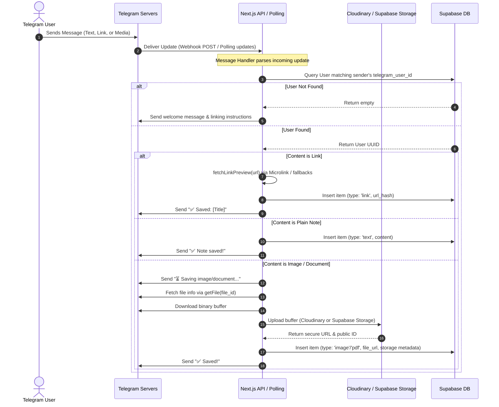
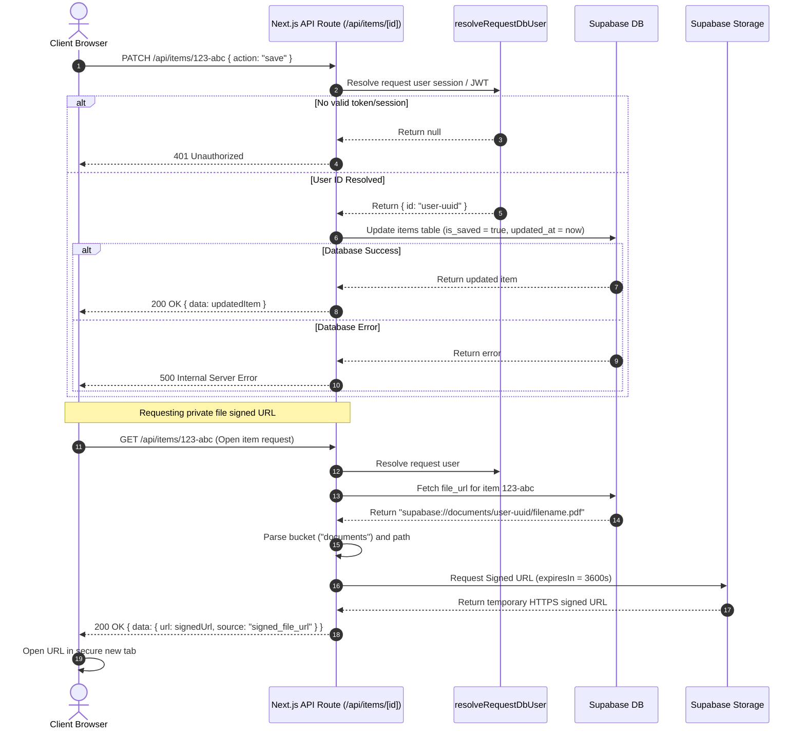

# Architectural Guide: drop_it

This document provides a detailed layout of the architecture, communication layers, execution flows, request lifecycles, and dependency graphs that govern the `drop_it` system.

---

## 1. Architectural Layers & Responsibilities

The application is structured into four distinct layers to separate UI logic, routing, service integrations, and the data schema.

```
┌──────────────────────────────────────────────────────────┐
│                    1. FRONTEND CLIENT                    │
│   (Dashboard, Navbar, ItemGrid, ItemCard, Providers)     │
└────────────────────────────┬─────────────────────────────┘
                             │ (HTTPS / JSON API)
┌────────────────────────────▼─────────────────────────────┐
│                    2. NEXT.JS API ROUTES                 │
│      (auth, items, folders, linking, user/telegram)      │
└────────────────────────────┬─────────────────────────────┘
                             │ (Service Methods / Calls)
┌────────────────────────────▼─────────────────────────────┐
│                    3. SERVICE UTILITIES                  │
│   (auth, storage wrappers, telegram api, link parsing)   │
└────────────────────────────┬─────────────────────────────┘
                             │ (SQL / RPC / Storage API)
┌────────────────────────────▼─────────────────────────────┐
│                    4. DATABASE & STORAGE                 │
│      (Supabase tables, Storage buckets, Cloudinary)      │
└──────────────────────────────────────────────────────────┘
```

### 1.1. Frontend Client (Client-Side React)
*   **Location**: `app/dashboard/`, `app/components/`, `app/link/`, `app/auth/`
*   **Responsibility**: Renders the responsive user interface, manages client-side filters (view mode, sections, tags, folders, times), handles OAuth redirects, opens files securely via popup tabs, and triggers modal overlays.
*   **State Management**: Purely local React state hooks (`useState`, `useCallback`, `useEffect`) combined with server session states provided by NextAuth's client provider (`SessionProvider`).

### 1.2. Server Router & Controllers (Next.js API Routes)
*   **Location**: `app/api/`
*   **Responsibility**: Validates request sessions and JWT credentials, processes incoming HTTP requests (GET, POST, PATCH, DELETE), extracts parameters, interfaces with service handlers, and maps query responses back to the client.

### 1.3. Integration Services (Server-Side JS/TS Utilities)
*   **Location**: `lib/`
*   **Responsibility**: Contains logic to interact with external providers:
    *   `lib/telegram/`: Wraps the Telegram Bot API client, handles message parsing logic, and runs the dev update loop.
    *   `lib/storage/`: Manages Cloudinary image upload signatures and Supabase Storage uploads/signed-url generations.
    *   `lib/handlers/`: Scrapes content metadata using Microlink or fallback custom HTML matches.
    *   `lib/auth/`: Decodes request headers/cookies to resolve active NextAuth users in the Supabase database.

### 1.4. Database & Storage Layer (Supabase & Cloudinary)
*   **Location**: `supabase/migrations/`
*   **Responsibility**: Holds data records, enforces foreign key relationships, triggers auto-timestamps, handles soft-delete purges via Postgres RPCs, and serves CDN images and document assets.

---

## 2. Ingestion & Capture Flow (Telegram to Database)

When a message is sent to the Telegram bot, it triggers the capture pipeline. Below is the sequence:



---

## 3. Web Request Lifecycle (Dashboard Actions)

How requests from the client move through the API route structure:



---

## 4. Control Flow: Polling vs. Webhook Mode

The bot ingestion operates in two mutually exclusive modes determined by `TELEGRAM_MODE`:

### 4.1. Local Development (Polling Mode)
1.  On Next.js development server boot, `instrumentation.ts` triggers `startTelegramPolling()`.
2.  `pollingService.ts` checks global variables to prevent duplicate loops, makes an HTTP call to delete existing webhook URLs, and starts an asynchronous loop (`runPollingLoop`).
3.  The loop sends a periodic POST to `api.telegram.org/bot<token>/getUpdates` with a timeout of 25 seconds.
4.  Updates are processed sequentially, updating the offset pointer (`update_id + 1`) to mark messages as acknowledged.
5.  If a network error occurs, the process waits for `TELEGRAM_POLLING_INTERVAL_MS` before retrying.

### 4.2. Production (Webhook Mode)
1.  The developer registers the webhook URL `/api/telegram/webhook` with Telegram.
2.  For every incoming message, Telegram sends a POST request containing the payload and a secret header `x-telegram-bot-api-secret-token`.
3.  The API route checks the secret using timing-safe comparisons to prevent timing attacks.
4.  Once validated, the route fires `handleTelegramMessage(update)` asynchronously (without waiting for resolution) and immediately sends back a `200 OK` response to Telegram. This prevents Telegram from retrying the request due to processing delays.

---

## 5. Media Routing Strategy
The strategy used to write capturing files is determined by `FILE_STORAGE_STRATEGY` in the format `image:cloudinary,doc:supabase`:

```
Incoming Media File
         │
         ├──► Is MIME Type image/* ?
         │          │
         │          ├──► Yes ──► Send to Cloudinary CDN ──► Stored as HTTPS URL
         │          │
         │          └──► No ───► Send to Supabase Storage ──► Stored as private URI (supabase://...)
         │
         └──► Fallback/Configuration Override (env file_storage_strategy)
```
This partition leverages Cloudinary for fast browser image loading and resizing while securing sensitive files and documents inside Supabase Private Storage buckets.
