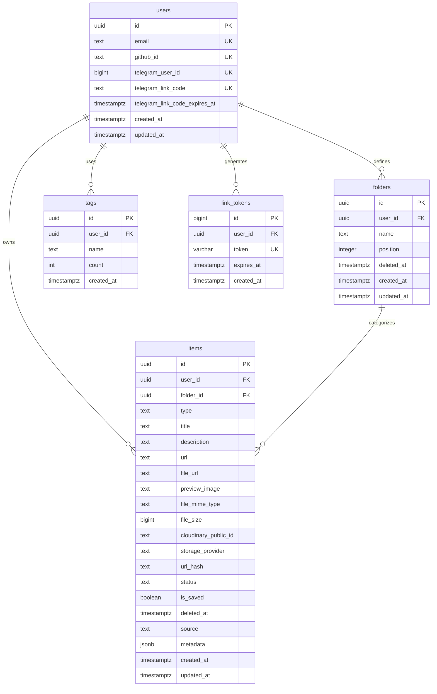

# Database Blueprint: drop_it

The `drop_it` database is built on **PostgreSQL**, hosted on Supabase, and secured with PostgreSQL Row Level Security (RLS) policies.

---

## 1. Entity Relationship Diagram (ERD)



---

## 2. Table Schemas

### 2.1. `public.users`
Stores user authentication details and links dashboard accounts to Telegram accounts.

*   `id`: `uuid` (Primary Key, defaults to `gen_random_uuid()`)
*   `email`: `text` (Not Null, Unique)
*   `github_id`: `text` (Unique) - Links to the user's GitHub provider account.
*   `telegram_user_id`: `bigint` (Unique) - Holds the user's numeric Telegram ID.
*   `telegram_link_code`: `text` (Unique) - 6-character code for manual pairing.
*   `telegram_link_code_expires_at`: `timestamptz` - Expiration time for manual pairing codes.
*   `created_at`, `updated_at`: `timestamptz` (defaults to `now()`)

### 2.2. `public.items`
Stores all captured links, plain notes, images, and documents.

*   `id`: `uuid` (Primary Key, defaults to `gen_random_uuid()`)
*   `user_id`: `uuid` (Foreign Key -> `public.users(id)` ON DELETE CASCADE)
*   `folder_id`: `uuid` (Foreign Key -> `public.folders(id)` ON DELETE SET NULL)
*   `type`: `text` (Check constraint: `type IN ('link', 'image', 'text', 'pdf', 'document')`)
*   `title`: `text` (Not Null)
*   `description`: `text`
*   `url`: `text`
*   `file_url`: `text` - Supabase Storage path or Cloudinary URL.
*   `preview_image`: `text` - Thumbnail URL for dashboard display.
*   `file_mime_type`: `text` - The file's MIME type (e.g. `application/pdf`).
*   `file_size`: `bigint` - Size of the file in bytes.
*   `cloudinary_public_id`: `text` - The public ID for deleting images from Cloudinary.
*   `storage_provider`: `text` - Specifies the storage host (`cloudinary` or `supabase-storage`).
*   `tags`: `text[]` (defaults to `{}`) - Tags associated with the item.
*   `status`: `text` (Check constraint: `status IN ('unread', 'read')`, defaults to `unread`)
*   `is_saved`: `boolean` (defaults to `false`) - Indicates if the item is saved/starred.
*   `deleted_at`: `timestamptz` - Timestamp when soft-deleted (null if active).
*   `source`: `text` (Check constraint: `source IN ('telegram', 'web', 'import')`, defaults to `telegram`)
*   `url_hash`: `text` - SHA-256 hash of the URL (used for duplicate detection).
*   `metadata`: `jsonb` - Rich preview metrics or Telegram-specific metadata.
*   `created_at`, `updated_at`: `timestamptz` (defaults to `now()`)

### 2.3. `public.folders`
Allows users to organize their captured items.

*   `id`: `uuid` (Primary Key, defaults to `gen_random_uuid()`)
*   `user_id`: `uuid` (Foreign Key -> `public.users(id)` ON DELETE CASCADE)
*   `name`: `text` (Not Null)
*   `position`: `integer` (defaults to `0`) - Position for ordering folders in the UI.
*   `deleted_at`: `timestamptz` - Soft-delete timestamp.
*   `created_at`, `updated_at`: `timestamptz` (defaults to `now()`)

### 2.4. `public.link_tokens`
Stores temporary tokens used during the account auto-linking process.

*   `id`: `bigint` (Primary Key, Auto-incrementing)
*   `user_id`: `uuid` (Foreign Key -> `public.users(id)` ON DELETE CASCADE)
*   `token`: `varchar(48)` (Not Null, Unique)
*   `expires_at`: `timestamptz` (Not Null)
*   `created_at`: `timestamptz` (defaults to `now()`)

---

## 3. Database Indexes

These indexes ensure queries remain fast as the database grows:

*   `idx_items_user_created_at` (`user_id`, `created_at DESC`): Speeds up fetching the latest items for a user.
*   `idx_items_user_status` (`user_id`, `status`): Accelerates filtering items by read status (`read` or `unread`).
*   `idx_items_user_tags` (`tags` using GIN): Speeds up tag searches.
*   `idx_items_title_search` (GIN over English `to_tsvector` on `title` and `description`): Enables fast text search.
*   `idx_items_user_deleted_at` (`user_id`, `deleted_at`): Speeds up active vs. trashed item checks.
*   `idx_items_user_saved_status_created` (`user_id`, `is_saved`, `status`, `created_at DESC`): Optimizes fetches for the "Saved" section.
*   `idx_items_user_active_created` (`user_id`, `created_at DESC` WHERE `deleted_at IS NULL`): Speeds up active inbox queries.
*   `idx_folders_user_name_active` (`user_id`, `lower(name)` WHERE `deleted_at IS NULL`): Prevents duplicate active folder names for a user.
*   `idx_link_tokens_token` (`token`): Speeds up token lookups during account linking.

---

## 4. Triggers & Auto-Updates

The database automatically manages timestamps and soft-delete cleanups:

1.  **set_updated_at Trigger**: Updates the `updated_at` column automatically whenever a row is modified in the `users`, `items`, or `folders` tables.
2.  **delete_expired_link_tokens Function**: Helper function to remove expired linking tokens.
3.  **purge_expired_trashed_items Function**: Deletes trashed items older than 7 days:
    ```sql
    DELETE FROM public.items
    WHERE deleted_at IS NOT NULL
      AND deleted_at < NOW() - INTERVAL '7 days'
      AND (target_user_id IS NULL OR user_id = target_user_id);
    ```

---

## 5. Security & Row Level Security (RLS)

All tables have RLS enabled by default. To simplify local development, **all standard operations bypass public RLS and run server-side using the `service_role` key** via `supabaseAdmin`.

### Active RLS Policies
```sql
-- Enforces service_role access for all tables
CREATE POLICY table_service_role_all ON public.table
  FOR ALL USING (auth.role() = 'service_role') WITH CHECK (auth.role() = 'service_role');
```
*   `public.users`: Protected from public select, insert, update, and delete actions.
*   `public.items`: Protected from public access. Server actions use the admin client to fetch and modify items for authenticated users.
*   `public.folders`: Protected from public access. Modified only by server-side routes.
*   `storage.objects`: The `documents` bucket allows inserts, updates, and selects only for requests using the `service_role` key.
