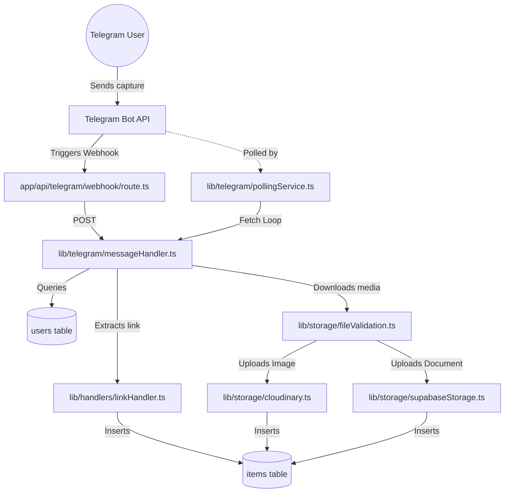
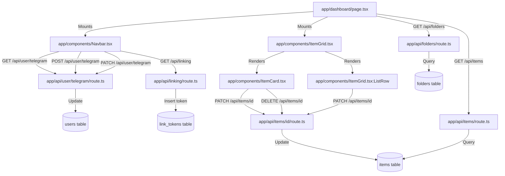
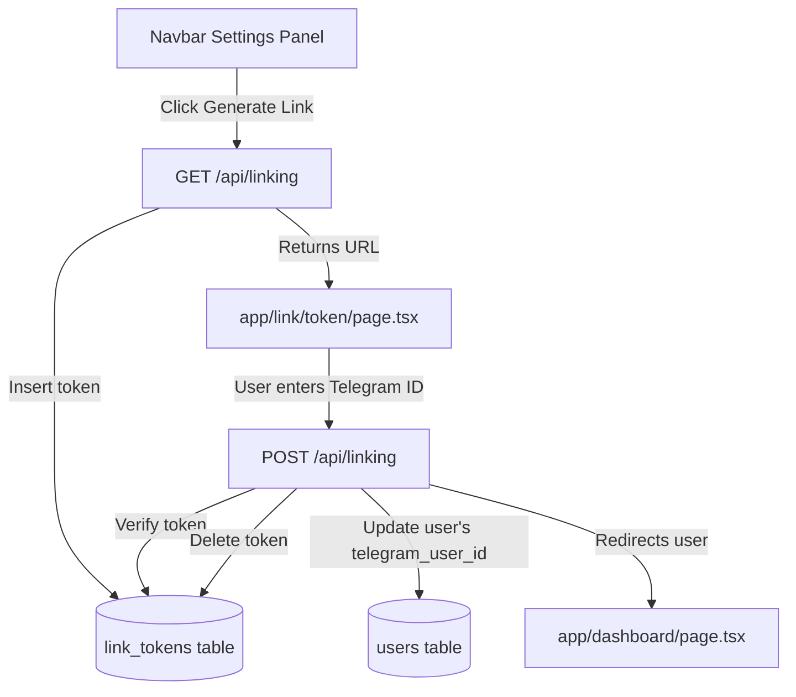

# System Knowledge Graph: drop_it

This document provides a visualization of the relationships between components, API routes, services, database tables, and external integrations in the `drop_it` system.

---

## 1. System Ingestion Graph

This graph shows how messages sent to the Telegram bot are processed and stored in the database.

---

## 2. Dashboard Interface Graph

This graph shows how the dashboard UI queries the API and handles updates.

---

## 3. Account Auto-Linking Graph

This graph shows the flow for auto-linking a Telegram account to a dashboard user account.

